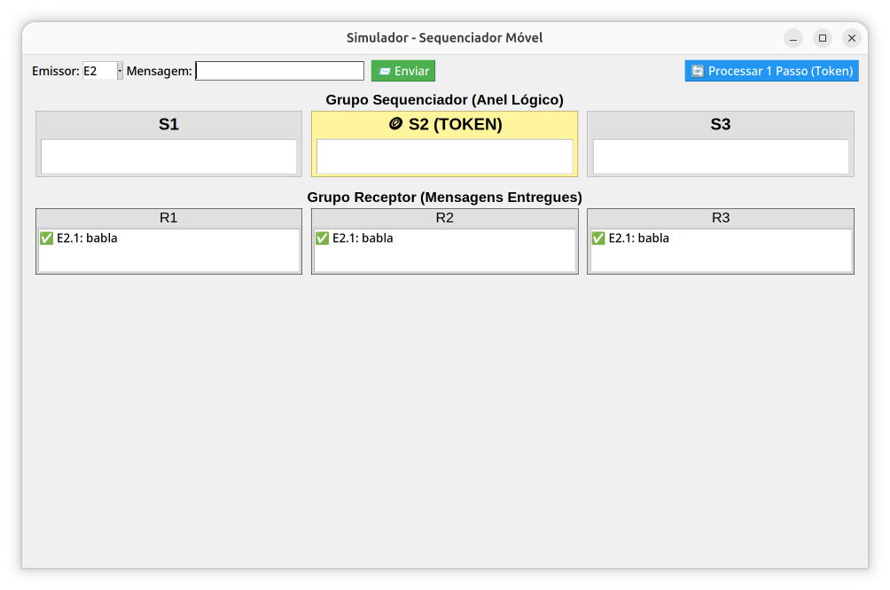
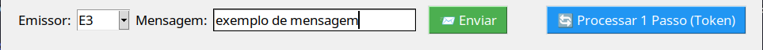
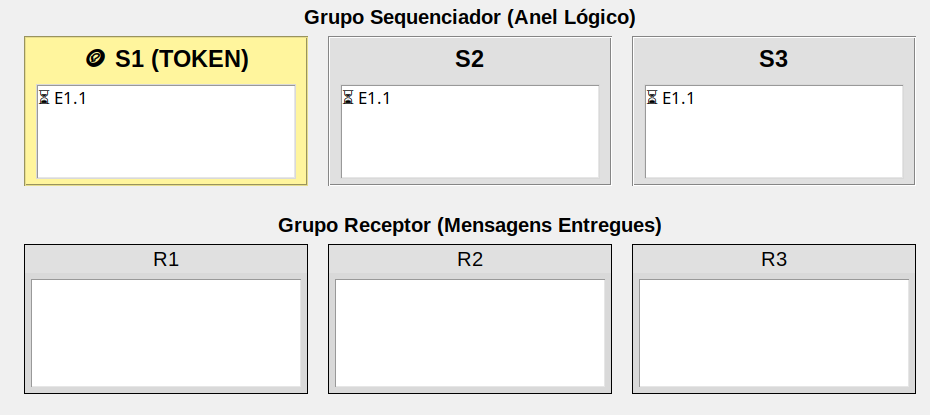
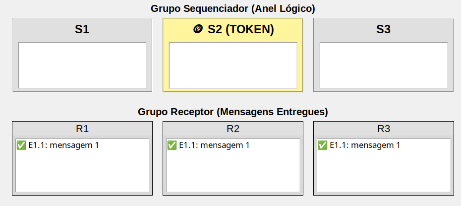

# Sequenciador Móvel

## Funcionamento

O sequenciador móvel é uma entidade/processo que fica responsável por definir a ordem das mensagens ou eventos em um sistema distribuído,com a diferença que essa função de sequenciar pode “mudar de lugar” entre os nós do sistema. Essa técnica surgiu como uma solução para os problemas de confiabilidade encontrados no modelo de sequenciador fixo.

>  A difusão atômica garante que todos os processos corretos entregarão todas as mensagens e na mesma ordem total destas mensagens. Desta forma, todos os processos têm a mesma visão do sistema e podem agir de maneira consistente sem comunicações adicionais.

Diferente do sequenciador fixo, onde um único nó decide a ordem de todas as mensagens, o sequenciador móvel distribui essa responsabilidade entre um conjunto de nós.

É definido um grupo pequeno de processos (geralmente entre 2 a 4 membros) que formam um anel lógico, estes são o Grupo de Sequenciadores.

O privilégio de ordenar e repassar as mensagens circula por esse anel por meio de um *token*. Apenas o processo que possui o bastão no momento pode definir a ordem e enviar as mensagens ao grupo receptor.

Quando um emissor quer enviar uma mensagem, ele a difunde para todo o **grupo de sequenciadores**. O sequenciador que detém o bastão recebe essa mensagem, atribui-lhe uma ordem e a repassa para os destinatários finais

Como cada processo receptor conhece a sequência exata dos processos no anel lógico dos sequenciadores, eles conseguem estabelecer uma **ordem total determinística** das mensagens recebidas, garantindo que todos os membros do grupo vejam as informações na mesma sequência.

### Vantagens

- Ao contrário do sequenciador fixo, que é um ponto único de falha (se ele cai, o sistema para), o sequenciador móvel permite que o sistema continue operando mesmo que um dos coordenadores falhe;
- Maior escalabilidade: Permite que o grupo emissor cresça sem sobrecarregar um único ponto central de forma permanente;

### Desvantagens

- Perda do Token: Se o processo que está com o bastão falha no momento da posse, o sistema precisa de mecanismos para regenerar o *token* e manter a circulação;
- Todos os receptores precisam saber a ordem correta do anel lógico dos sequenciadores para que a ordenação funcione corretamente;

Para esse algoritmo, um código demonstrativo de um sequenciador móvel, que envolve um grupo emissor, um grupo sequenciador organizado em anel lógico com token, e um grupo receptor. O emissor difunde a mensagem ao grupo sequenciador, e apenas o sequenciador que possui o token repassa a mensagem ao grupo receptor.

A aplicação foi implementada no modelo cliente-servidor. O cliente representa o grupo emissor, permitindo que o usuário escolha um emissor e envie mensagens ao servidor. O servidor executa o algoritmo de sequenciador móvel, mantendo o grupo sequenciador em anel lógico, o token de privilégio e o grupo receptor. A cada mensagem recebida, o servidor a difunde internamente ao grupo sequenciador. Apenas o sequenciador com token repassa a mensagem ao grupo receptor, atribuindo um número de sequência global.

O arquivo `client.py` é a interface entre o grupo emissor e o restante. O usuário escolhe o emissor e escreve a mensagem a ser enviada, e envia a requisição ao servidor via socket TCP.

O arquivo `server.py` mantém os metadados dos grupos sequenciador, e receptor, além de manter/atualizar os buffers dos sequenciadores, guarda a informação do anél lógico, e do token/bastão, atribui os números de sequência, e entrega as mensagens ao grupo receptor. 

O nosso sistema conta com uma interface gráfica, composto por dois programas, `server.py` e `client.py`. 

O `client.py` cria uma interface gráfica com Tkinter. A interface pode ser vista na imagem abaixo.



Na parte superior, o usuário escolhe entre os emissores disponiveis, chamados de E1, E2, e E3. Ao clicar em enviar, o cliente manda uma requisição pro servidor:

```
{"command": "SEND", "sender_id": "E2", "content": "blablabla"}
```
Quando o usuário clicar em _Processar 1 Passo (Token)_, o cliente manda `{"command": "PROCESS_ONE"}`.

No `server.py`, o núcleio da aplicação, possui os grupos emissor, sequenciador, e receptor. Cada sequenciador tem um buffer próprio: `self.buffer = deque()`. O servidor também guarda a posição atual do token, o número global de sequência, e as mensagens já entregues.

Quando uma mensagem chega, o servidor cria um identificador, `E2.1` por exemplo. Isso significa que é primeira mensagem enviada pelo emissor E2. Depois, essa mensagem é colocada no buffer de sequenciadores, como ilustrado abaixo:

```
S1 recebe E2.1
S2 recebe E2.1
S3 recebe E2.1
```
Isso simula a difusão do emissor para o grupo sequenciador.

O token define qual sequenciador tem o direito de repassar uma mensagem ao grupo receptor. Na imagem, token está com S2. Quando o usuário clica em `Processar 1 Passo (Token)`, o servidor executa o seguinte fluxo:

1. Verifica quem está com o token.
2. Esse sequenciador procura uma mensagem pendente em seu buffer.
3. Se encontrar, atribui um número de sequência global.
4. Entrega a mensagem para R1, R2 e R3.
5. Marca a mensagem como entregue.
6. Passa o token para o próximo sequenciador.

## Requisitos Funcionais

O sistema implementa a simulação de um protocolo de difusão totalmente ordenada (*Total Order Broadcast*) baseado no algoritmo de **Sequenciador Móvel** com anel lógico. Os requisitos funcioanis são:

| ID | Requisito | Descrição |
| :--- | :--- | :--- |
| **RF01** | **Envio e Difusão de Mensagens** | O sistema permite que emissores (`E1`, `E2`, `E3`) enviem mensagens que são difundidas simultaneamente para as filas (*buffers*) de todos os sequenciadores (`S1`, `S2`, `S3`). |
| **RF02** | **Identificação Única** | Cada mensagem gerada recebe um identificador imutável composto pelo ID do emissor e um contador (ex: `E1.1`). |
| **RF03** | **Anel Lógico (Token)** | O sistema mantém um anel de sequenciadores onde apenas um membro detém o privilégio de ordenação (o *Token*) a cada instante. O token circula de forma sequencial (`S1 → S2 → S3 → S1`). |
| **RF04** | **Sequenciamento Global** | O sequenciador com o token extrai a próxima mensagem do seu buffer, atribui um número de sequência global consecutivo e marca a mensagem como processada. |
| **RF05** | **Entrega aos Receptores** | Após o sequenciamento, a mensagem ordenada é entregue na mesma ordem a todos os receptores lógicos (`R1`, `R2`, `R3`). |
| **RF06** | **Monitorização Visual** | A interface permite inspecionar, em tempo real, a posição do token, o conteúdo das filas de cada sequenciador e o histórico de entrega nos receptores. |


## Interação entre `client.py` e `server.py`

## Como Utilizar

Para esse algoritmo, um código demonstrativo de um sequenciador móvel, que envolve um grupo emissor, um grupo sequenciador organizado em anel lógico com token, e um grupo receptor. O emissor difunde a mensagem ao grupo sequenciador, e apenas o sequenciador que possui o token repassa a mensagem ao grupo receptor.

A aplicação foi implementada no modelo cliente-servidor. O cliente representa o grupo emissor, permitindo que o usuário escolha um emissor e envie mensagens ao servidor. O servidor executa o algoritmo de sequenciador móvel, mantendo o grupo sequenciador em anel lógico, o token de privilégio e o grupo receptor. A cada mensagem recebida, o servidor a difunde internamente ao grupo sequenciador. Apenas o sequenciador com token repassa a mensagem ao grupo receptor, atribuindo um número de sequência global.

O arquivo `client.py` é a interface entre o grupo emissor e o restante. O usuário escolhe o emissor e escreve a mensagem a ser enviada, e envia a requisição ao servidor via socket TCP.

O arquivo `server.py` mantém os metadados dos grupos sequenciador, e receptor, além de manter/atualizar os buffers dos sequenciadores, guarda a informação do anél lógico, e do token/bastão, atribui os números de sequência, e entrega as mensagens ao grupo receptor. 

O nosso sistema conta com uma interface gráfica, composto por dois programas, `server.py` e `client.py`. 

O `client.py` cria uma interface gráfica com Tkinter. A interface pode ser vista na imagem abaixo.


Na parte superior, o usuário escolhe entre os emissores disponiveis, chamados de E1, E2, e E3. Ao clicar em enviar, o cliente manda uma requisição pro servidor:

```
{"command": "SEND", "sender_id": "E2", "content": "blablabla"}
```
Quando o usuário clicar em _Processar 1 Passo (Token)_, o cliente manda `{"command": "PROCESS_ONE"}`.

No `server.py`, o núcleio da aplicação, possui os grupos emissor, sequenciador, e receptor. Cada sequenciador tem um buffer próprio: `self.buffer = deque()`. O servidor também guarda a posição atual do token, o número global de sequência, e as mensagens já entregues.

Quando uma mensagem chega, o servidor cria um identificador, `E2.1` por exemplo. Isso significa que é primeira mensagem enviada pelo emissor E2. Depois, essa mensagem é colocada no buffer de sequenciadores, como ilustrado abaixo:

```
S1 recebe E2.1
S2 recebe E2.1
S3 recebe E2.1
```
Isso simula a difusão do emissor para o grupo sequenciador.

O token define qual sequenciador tem o direito de repassar uma mensagem ao grupo receptor. Na imagem, token está com S2. Quando o usuário clica em `Processar 1 Passo (Token)`, o servidor executa o seguinte fluxo:

1. Verifica quem está com o token.
2. Esse sequenciador procura uma mensagem pendente em seu buffer.
3. Se encontrar, atribui um número de sequência global.
4. Entrega a mensagem para R1, R2 e R3.
5. Marca a mensagem como entregue.
6. Passa o token para o próximo sequenciador.

## Requisitos Funcionais

## Interação entre `client.py` e `server.py`

## Como Utilizar

## 1. Requisitos Funcionais

O sistema implementa a simulação de um protocolo de difusão totalmente ordenada (*Total Order Broadcast*) baseado no algoritmo de **Sequenciador Móvel** com anel lógico. Os requisitos funcioanis são:

| ID | Requisito | Descrição |
| :--- | :--- | :--- |
| **RF01** | **Envio e Difusão de Mensagens** | O sistema permite que emissores (`E1`, `E2`, `E3`) enviem mensagens que são difundidas simultaneamente para as filas (*buffers*) de todos os sequenciadores (`S1`, `S2`, `S3`). |
| **RF02** | **Identificação Única** | Cada mensagem gerada recebe um identificador imutável composto pelo ID do emissor e um contador (ex: `E1.1`). |
| **RF03** | **Anel Lógico (Token)** | O sistema mantém um anel de sequenciadores onde apenas um membro detém o privilégio de ordenação (o *Token*) a cada instante. O token circula de forma sequencial (`S1 → S2 → S3 → S1`). |
| **RF04** | **Sequenciamento Global** | O sequenciador com o token extrai a próxima mensagem do seu buffer, atribui um número de sequência global consecutivo e marca a mensagem como processada. |
| **RF05** | **Entrega aos Receptores** | Após o sequenciamento, a mensagem ordenada é entregue na mesma ordem a todos os receptores lógicos (`R1`, `R2`, `R3`). |
| **RF06** | **Monitorização Visual** | A interface permite inspecionar, em tempo real, a posição do token, o conteúdo das filas de cada sequenciador e o histórico de entrega nos receptores. |

## 2. Interação entre client.py e server.py

Para o escopo desta simulação, é fundamental destacar a divisão de responsabilidades:

* **O Servidor (`server.py`) é o motor da simulação:** Ele não é apenas um servidor web; ele simula toda a topologia da rede distribuída. É ele quem gerencia o estado do anel, o avanço do token e as filas de mensagens.
* **O Cliente (`client.py`) é apenas a interface (Thin Client):** Ele não realiza nenhum cálculo do algoritmo. Sua função é capturar a interação do usuário (clique em botões) e exibir o estado da rede na tela.

O cliente e o servidor se comunicam trocando mensagens curtas em JSON via Sockets TCP. O trecho de código abaixo, do `server.py`, demonstra como as requisições do cliente atuam como "gatilhos" para acionar os métodos do algoritmo de Sequenciador Móvel instanciados no servidor:

```python
# Trecho de server.py: O servidor interpreta o comando da interface e executa a simulação
def process_request(self, request):
    command = request.get("command")

    # Gatilho 1: Usuário clicou em "Enviar". 
    # O servidor simula a difusão da mensagem nos buffers de S1, S2 e S3.
    if command == "SEND":
        system.send_message_to_sequencer_group(request.get("sender_id"), request.get("content"))
        return {"ok": True}

    # Gatilho 2: Usuário clicou em "Processar 1 Passo".
    # O servidor faz o sequenciador atual processar a fila e passar o token adiante.
    if command == "PROCESS_ONE":
        system.process_current_token()
        return {"ok": True}

    # Gatilho 3: A interface pede os dados para atualizar a tela.
    # O servidor devolve quem tem o Token, as filas de S1/S2/S3 e as entregas em R1/R2/R3.
    if command == "GET_GUI_STATE":
        with system.lock: # Proteção para leitura simultânea
            return {
                "ok": True,
                "output": {
                    "token": system.current_sequencer().sequencer_id,
                    "buffers": {
                        s.sequencer_id: s.pending_messages(system.delivered_ids) 
                        for s in system.sequencers
                    },
                    "receivers": {
                        r.receiver_id: [f"{m.msg_id}: {m.content}" for m in r.delivered_messages]
                        for r in system.receivers
                    }
                }
            }
```

## Como Utilizar
O simulador é desenvolvido em Python puro e não exige instalação de bibliotecas externas de terceiros, pois utiliza os módulos nativos socket, json, threading e tkinter.

### Passo 1: Iniciar o Servidor
Abra um terminal, navegue até o diretório onde os arquivos estão salvos e execute o arquivo do servidor:

`python server.py`

O console exibirá: Servidor iniciado em 127.0.0.1:5000. Ele deve permanecer aberto em segundo plano.

### Passo 2: Iniciar o Cliente Gráfico
Em um segundo terminal, execute a interface do cliente:

`python client.py`

### Passo 3: Operando o Simulador
Com a janela da aplicação aberta (Dashboard Sequenciador), siga os passos de interação:

Simular Envios: No painel superior, selecione o Emissor na lista suspensa (ex: E1), digite um texto no campo "Mensagem" e clique no botão 📨 Enviar. Repare que a mensagem aparecerá com um ícone de ampulheta (⏳) nos painéis dos sequenciadores, indicando que está no buffer aguardando processamento.




Simular o Token (Sequenciamento): Clique no botão 🔄 Processar 1 Passo (Token).

O Token (destaque amarelo 🪙) passará para o próximo sequenciador.

Se o sequenciador atual possuir a mensagem pendente, ela sairá do painel superior e aparecerá no painel inferior (Grupo Receptor) com um visto (✅), confirmando que foi globalmente ordenada e entregue.



Testar Concorrência: Enviar várias mensagens de emissores diferentes (E1, E2, E3) seguidamente antes de processar os passos do token, para observar como os buffers se comportam e como a ordem lógica é mantida nos receptores ao dar os passos subsequentes.
